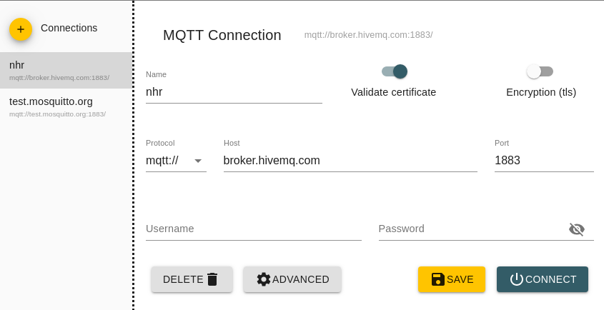
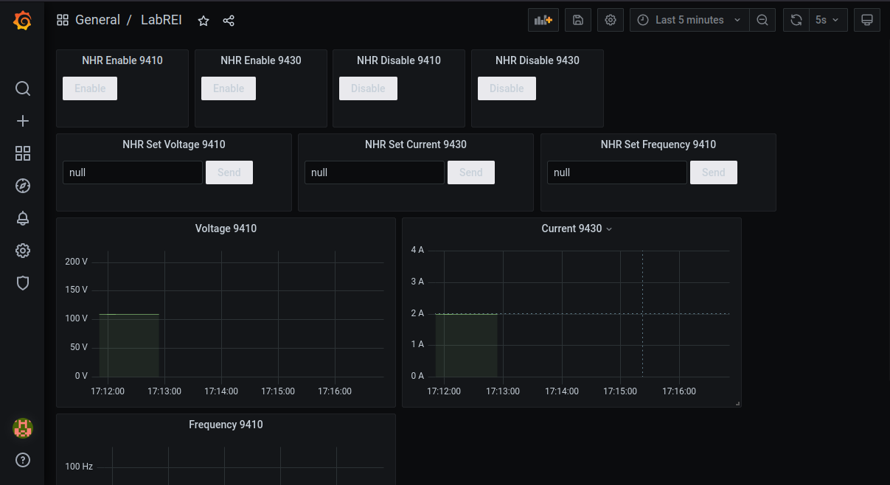

Here's the translated text in English:

---

# Main

## Activating the Virtual Environment:

Before running the code, activate the virtual environment using the following command:

```bash
source ic-labrei/bin/activate
```

## Installing Requirements:

Make sure all necessary libraries are installed by running the following command:

```bash
pip install -r requirements.txt
```

## Running the Code:

To run the code, use the following command:

```bash
sudo ic-labrei/bin/python3 main.py
```

Remember to have superuser ("sudo") permissions for execution if necessary.

*Note*: You might need to run the `docker-compose.yml` before `main.py`.

# Containers and MQTT

## Start Docker Containers

It is important to start the Docker containers using `docker-compose.yml`. You will need to have Docker and Docker Compose installed on your machine.

```bash
docker-compose up
```

*Note*: This command will lock the terminal with the container logs, so open another terminal if needed.

## Configuring HiveMQ (MQTT):

To use MQTT communication, you need to use a broker like HiveMQ. I recommend using MQTT Explorer, an MQTT client that provides connectivity access.



*Note*: You can analyze the messages stored in the InfluxDB database using the following commands:

```bash
docker exec -it influxdb sh
```
```bash
influx
```
```bash
use influx
```
```bash
select * from mqtt_consumer
```

A dataset of stored information from InfluxDB will be displayed.

## Configuring Grafana:

Open your preferred browser and enter the URL below to access the Grafana container:

```bash
http://localhost:3001/login
```

- username: admin
- Password: admin

Go to the Dashboards tab and import the LabREI dashboard.

At the end, a screen will appear where you can send and receive parameters.



---
